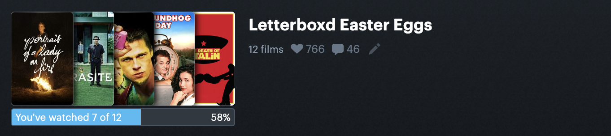
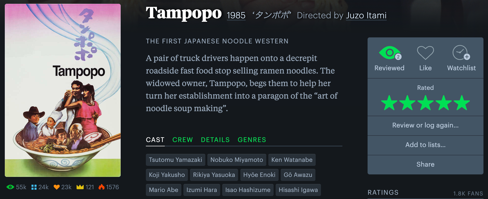

# Letterboxd userscripts

## Installation

1. Download a userscript manager such as [Tampermonkey](https://www.tampermonkey.net/) or [Greasemonkey](https://addons.mozilla.org/en-US/firefox/addon/greasemonkey/).
2. Click on your desired script in the file list above, then click the "Raw" button.

## List of scripts

### Friends Average for Letterboxd (`friends-average-histogram.user.js`)

Shows a histogram and ratings average for just the users you follow, in addition to the global one. Port of the ["Friends Average for Letterboxd"](https://chrome.google.com/webstore/detail/friends-average-for-lette/fffalfghjklopnhmkpdadlfopnnbnabg) Chrome extension by Klaspas.

### ~~Letterboxd Lists Progress (`letterboxd-lists-progress.user.js`)~~ currently broken

Displays list progress underneath cover art. Port of the ["Letterboxd Lists Progress"](https://chrome.google.com/webstore/detail/letterboxd-lists-progress/cjpnlmdbmlefonmfkobjpfpmpbaijldn) Chrome extension by Lucas Franco.

### ~~Letterboxd Top 2000 (`top-2000.user.js`)~~ currently broken

Displays relative ranking (crown) & popularity (flame) for the top 2000 films. Port of the ["Letterboxd Top 2000"](https://chrome.google.com/webstore/detail/letterboxd-top-2000/akajmboonlckanooginhfnpafjjnimko) Chrome extension by koenhagen.

